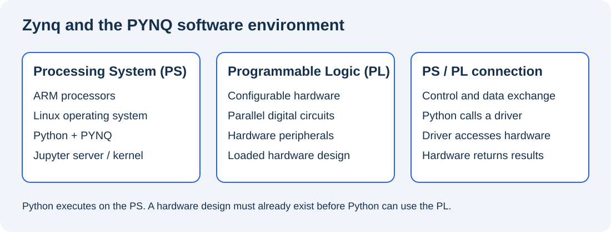
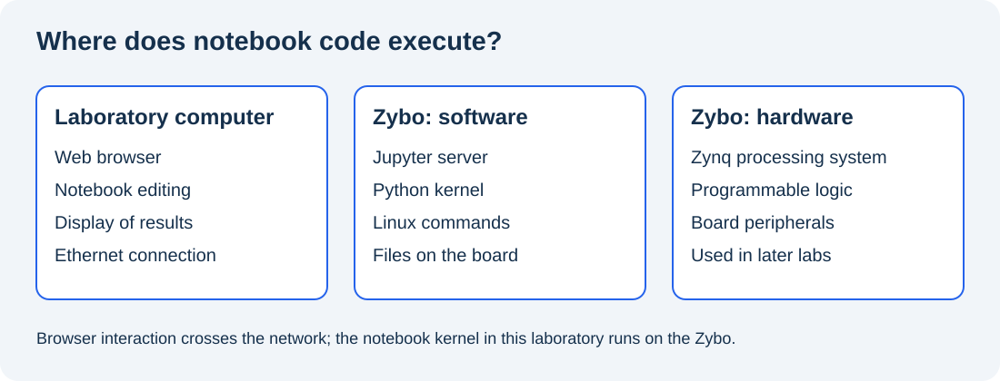

# Lab 0 – Getting Started with PYNQ

**Platform:** Digilent Zybo (original / legacy board) with the course PYNQ 3.0.1 image  
**Level:** Master’s students in Computer Science Engineering

> The network connection procedure will be verified on the course Zybo image before classroom use.

## Objectives

By the end of this laboratory, you will be able to explain the role of PYNQ, distinguish the Zynq processing system from programmable logic, access the board through a browser, and run and save a Python notebook.

## 1. What is PYNQ?

PYNQ is an open-source framework from AMD for using programmable hardware through Python and Jupyter. Its name originated as **Python Productivity for Zynq**. For this course, PYNQ runs on a Zynq-7000 device. [1]

A Zynq device combines two parts:

| Part | What it does | Example in this course |
| --- | --- | --- |
| Processing System (PS) | Runs software on ARM processors | Linux, Python and the Jupyter server |
| Programmable Logic (PL) | Implements configurable digital circuits | Hardware peripherals and accelerators used in later laboratories |



*Figure 1. Conceptual view of the system; this is not a wiring diagram.*

PYNQ provides Python APIs for interacting with existing hardware designs. Such designs are called **overlays**. Using an overlay and creating one are different activities: creating new hardware still requires FPGA design tools. We will use that distinction in later labs; Lab 0 concentrates on accessing Linux and executing Python. [1]

## 2. Development boards: PYNQ-Z2 and Zybo

**PYNQ is a software framework; PYNQ-Z2 is a physical development board.** PYNQ-Z2 is a reference platform used in official tutorials. Our course uses a **Digilent Zybo**, with a PYNQ image prepared specifically for that board. Support for another Zynq board requires a compatible boot image and hardware designs. [2][3]


*Figure 2. PYNQ-Z2 reference board. Source: [official PYNQ setup guide][2]. The jumper settings shown here apply to PYNQ-Z2; use the course Zybo setup for our board.*

Locate these items on the Zybo before switching it on:

| Item | Purpose in Lab 0 |
| --- | --- |
| Zynq device | Executes the board software and contains the programmable logic |
| DDR memory | Holds running programs and their data |
| microSD card | Contains the course boot image and filesystem |
| Ethernet connector | Connects the browser on the PC to the board |
| USB/UART connection | Provides a serial console when Ethernet access is unavailable |
| Power input and switch | Supply power and start the board |
| LEDs, switches and buttons | Board peripherals that will be explored in later labs |

The board model matters: boot configuration, image files and overlays are board-specific. Use the **course Zybo image**, rather than a PYNQ-Z2 image. [3]

## 3. Jupyter, notebooks and JupyterLab

### 3.1 What is a notebook?

A Jupyter notebook is an interactive document stored as an `.ipynb` file. It combines explanations, executable code and results. A **Markdown cell** contains formatted text; a **code cell** contains instructions sent to a kernel. The **kernel** is the process that executes the code and keeps variables in memory. [4]



*Figure 3. Execution location for this course. Python and notebook shell commands run on the board.*

For example, `!hostname` executed in the board’s notebook reports the **board’s** hostname. A terminal opened in that Jupyter session also runs on the board. `ipconfig` typed in Windows Command Prompt reports the **computer’s** network configuration.

### 3.2 Notebook interface or JupyterLab?

Both interfaces let you work with notebooks. The Notebook interface focuses on notebook documents; JupyterLab also presents files, terminals and multiple documents in a workspace. [4][5]


*Figure 4. Example JupyterLab interface. Source: [JupyterLab documentation][5]. The version installed on the course image may look different.*

| Area | Use |
| --- | --- |
| File browser | Locate, open and rename notebooks |
| Notebook editor | Edit Markdown and code cells |
| Output area | Read the result below a code cell |
| Kernel controls | Interrupt execution or restart the Python process |
| Terminal | Run Linux shell commands on the board |

Use whichever interface the course image provides. JupyterLab is not guaranteed to be installed on an older PYNQ image.

### 3.3 Essential notebook habits

Select a cell and press **Shift+Enter** to run it. Code executes in the order you run cells, which can differ from their order on the page. Restarting the kernel clears variables from memory; saving a notebook saves its cells and outputs, rather than a running Python process. [4]

Try this after you connect to the board:

```python
value = 10
```

In a second cell:

```python
print(value + 1)
```

The result is `11`. Restart the kernel and execute only the second cell: `value` is now undefined. Run the first cell again to restore it. Before submitting a notebook, restart the kernel and run all cells from top to bottom.

## 4. Boot and establish a serial connection

1. With the board switched off, insert the microSD containing the course Zybo image.
2. Check that the board is configured to boot from microSD, using the course Zybo settings.
3. Connect USB/UART and Ethernet. Use the power source specified for the course board.
4. Switch on the board and wait for Linux to boot.
5. In Windows Device Manager, find the board’s **USB Serial Port** under **Ports (COM & LPT)**.
6. Open PuTTY: **Serial**, the observed COM port, **115200 baud**, **8 data bits**, **1 stop bit**, **no parity**, **no flow control**. [6]

Use the credentials supplied by the instructor. Older standard PYNQ images used `xilinx` for both username and password; the course image may have different settings. [6]

At the board’s Linux prompt, run:

```bash
hostname
ip -4 addr
ip route
```

Record the Ethernet interface name and its active IPv4 address. Reading a configuration file alone does not tell you which DHCP address is currently assigned.

## 5. Connect under the laboratory network constraints

Students cannot change the laboratory PC’s Ethernet IP configuration, and the institutional network may not assign the board a DHCP address. Choose the method specified by the instructor.

### A. Network with DHCP, when available

Connect the PC and board to an approved network that provides DHCP. Read the board’s assigned address through the serial console, then open the browser at the course Jupyter address. The official PYNQ guide describes this method. [2]

### B. Configure the board for the existing PC subnet

On the PC, run:

```powershell
ipconfig
```

Record the **Ethernet adapter’s IPv4 address and subnet mask**, rather than an unrelated Wi-Fi or VPN adapter. The instructor must supply an available board address in that Ethernet subnet. Matching the first three numbers is sufficient only for a `/24` subnet (`255.255.255.0`).

For example, on an isolated direct connection, PC `192.168.137.1` with mask `255.255.255.0` and board `192.168.137.99` are in the same subnet. These are examples, not addresses to copy for every workstation.

**For a course image confirmed to use the legacy configuration from the supplied slides**, inspect and edit the board configuration through serial:

```bash
sudo cat /etc/network/interfaces.d/eth0
sudo nano /etc/network/interfaces.d/eth0
```

Change the address and mask to the values provided by the instructor. Save with **Ctrl+O**, **Enter**, then exit with **Ctrl+X**. Apply the configuration:

```bash
sudo systemctl restart networking
ip -4 addr
```

These legacy file and service names must be checked on the course image before use. If the image uses another network manager, follow the instructor’s procedure for that image. Keep the serial console open while changing the board configuration.

### C. Windows Internet Connection Sharing, when permitted

This method is suitable for a personal laptop or an instructor-configured PC. It changes the PC’s Ethernet configuration and may require administrator privileges; it is therefore not a general workaround for a locked laboratory PC.

Share the Internet-connected adapter with Ethernet, and use DHCP on the board. Read the assigned board address with `ip -4 addr` through serial. A board with only a static address will not automatically acquire an address from the sharing service.

## 6. Open Jupyter

Use the address and port supplied for the course image:

| Image configuration | Example browser address |
| --- | --- |
| Older PYNQ 2.2.1 default | `http://192.168.2.99:9090` |
| Configuration documented in the current PYNQ-Z2 guide | `http://192.168.2.99` |

Replace the example IP with the board’s actual address. Port `9090` is image-dependent, not a requirement of PYNQ. [2][6]

From Windows, you can first try `ping <board-ip>` using the actual address. A ping reply confirms IP reachability, but does not confirm that Jupyter is running. If the browser fails, recheck the active board address, subnet mask, cable and course server port through serial.

## 7. First notebook and submission

Create a **Python notebook** on the board and name it `Lab0_<student-name>.ipynb`. Run these cells:

```python
print("Hello from PYNQ!")
```

```python
import platform
import pynq

print("System:", platform.platform())
print("PYNQ:", pynq.__version__)
```

```python
!hostname
!ip -4 addr
```

Add a Markdown cell with this completed table:

| Parameter | Observed value |
| --- | --- |
| Board model | |
| Connection method (A, B or C) | |
| Board Ethernet IPv4 address | |
| Hostname | |
| Linux platform / kernel | |
| PYNQ version | |
| Notebook interface used | |

Also answer: **Where does your Python code execute, and what happens to variables when you restart the kernel?**

Save the notebook and download a copy to the PC for submission. Keep its executed outputs. Shut down Linux with `sudo shutdown -h now` in the serial console and wait for shutdown to complete before switching off power.

## References and image credits

[1]: https://pynq.readthedocs.io/en/latest/
[2]: https://pynq.readthedocs.io/en/latest/getting_started/pynq_z2_setup.html
[3]: https://pynq.readthedocs.io/en/v2.2.1/getting_started/other_boards.html
[4]: https://jupyter-notebook.readthedocs.io/en/stable/notebook.html
[5]: https://jupyterlab.readthedocs.io/en/stable/user/interface.html
[6]: https://pynq.readthedocs.io/en/v2.2.1/getting_started.html

- [1 — PYNQ introduction][1]
- [2 — PYNQ-Z2 setup guide and board illustration][2]
- [3 — PYNQ on other Zynq boards][3]
- [4 — Jupyter Notebook documentation][4]
- [5 — JupyterLab interface and screenshot][5]
- [6 — PYNQ 2.2.1 setup, serial console and legacy web port][6]
- [Xilinx PYNQ Workshop](https://github.com/Xilinx/PYNQ_Workshop)
- Course reference: `Lab1_EN.pptx`, supplied by the instructor; the legacy board network procedure above is adapted from its slides 2–4.

Figures 1 and 3 are original teaching diagrams. Figures 2 and 4 are reproduced from the linked official documentation and retain their upstream attribution. They illustrate the reference board and a general JupyterLab interface, rather than the exact course Zybo installation.

The two official documentation images are linked online. The original diagrams are included in `images/`; keep that folder beside this README.
